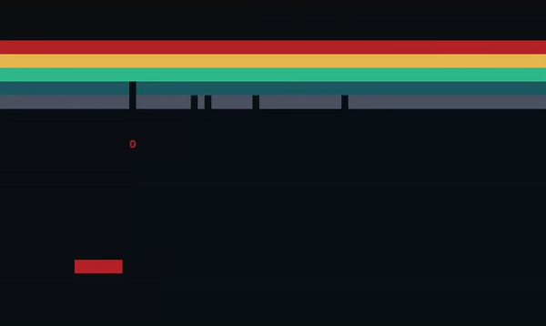

# Linux Shell/Breakout Game

A simple Linux shell that also allows you to play the Atari game *Breakout* in your command terminal.
## Features
The shell supports:

 - Changing directory with **cd**
 - Input and output redirection with **<** and **>**
 - Piping processes together with **|**
 - And combinations, i.e. **cat < input.txt | uniq --count | sort > output.txt**
## How to Use
 - Simply build the program with the makefile provided
 - Exit the shell by typing **exit**
 - Redirection and piping requires the special symbols (like **|** and **>**) to be separated from other items by space
 - To play breakout, type **breakout**
 - Exit breakout by pressing Escape

